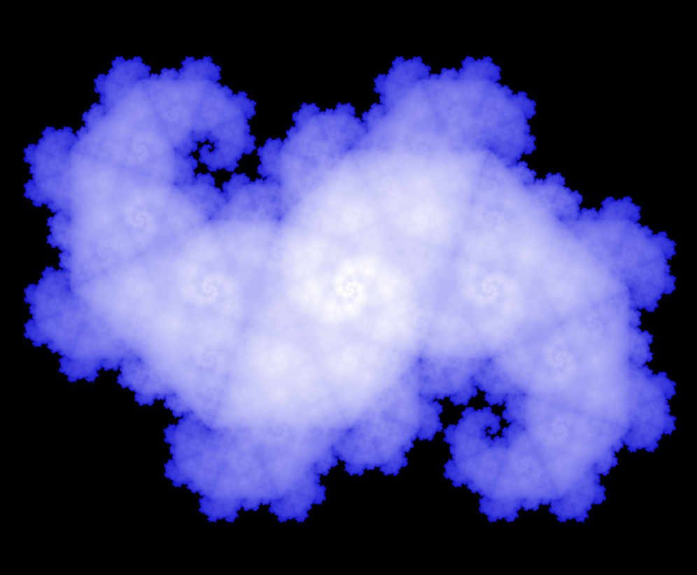

# Fractals Explored

This project explores a variety of fractals through code, using Rust and the creative coding framework Nannou. It includes visualizations built with iterated function systems (IFS), recursive algorithms, L-systems, and escape-time techniques.
Each fractal example links to reference materials used during its construction and demonstrates Nannou features that are often hard to find documented elsewhere.

## Examples

```sh
cargo run --release --example <file_name>
```
where <file_name> is the example's file name without the .rs extension.

## Fractal Directory

| Fractal             | Construction | Image                                             |
| ------------------- | ------------ | ------------------------------------------------- |
| Barnsley Fern       | IFS          |         |
| Koch Curve          | IFS          |           |
| Sierpinski Triangle | Recursive    |      | 
| Z2 Heighway Dragon  | IFS          |                 |

## Nannou Tips

Changing the cartesian plane origin placement on the window:
https://github.com/nannou-org/nannou/issues/733

```rust
draw = draw.x_y(-width*0.5, -height*0.5);
```

